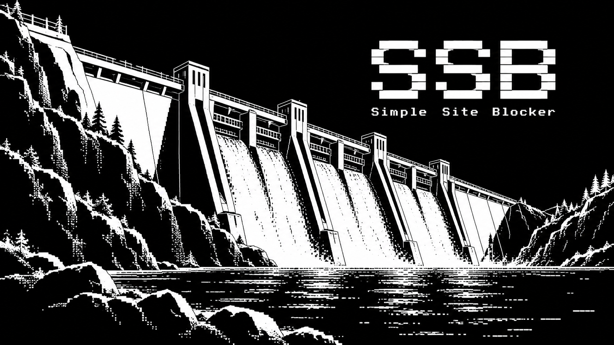

# SSB — Simple Site Blocker



SSB blocks selected websites during daily hours on Windows. Version 1.3.0 is an
installer-based revision built from the public **v1.0.2** tag. It retains that
version's blocking engine and quiet background saving.

## Install and open

Run `SSB-Setup-1.3.0.exe`, approve the administrator prompt, and open **SSB — Simple
Site Blocker** from Start or Windows search. The installer includes Python and
all runtime dependencies; a separate Python installation is not required.

Requirements: Windows 10/11 x64, administrator approval, and Microsoft Defender
Network Protection for the Windows firewall FQDN layer. ARM64 is not validated.

Setup installs in `C:\Program Files\SSB` and adds an Installed Apps entry.
It registers the existing visible **Simple Site Blocker** scheduled task.
The manager requests administrator access because saving changes updates Windows
firewall and browser policies.

## Websites and settings

The small light in the top-right corner shows the saved blocking state. Hover for
its label: yellow **Blocking primed** (saved and waiting), green **Blocking active**,
or red **Blocking disabled** (not configured/installed). Click it to refresh.
It also refreshes automatically while the window is open. Unsaved edits do not
change the saved blocking state.

- `C:\Program Files\SSB\config\list.json` contains the website list.
- `C:\Program Files\SSB\config\settings.json` contains hours and preferences.
- `C:\Program Files\SSB\config\backup.json` contains the previous saved configuration.
- `C:\Program Files\SSB\state` contains restoration and scheduling state.
- `C:\Program Files\SSB\logs\ssb.log` records operations and errors.

Use the app to edit these files together. Saving uses a recoverable transaction
and prevents concurrent writes. Setup and updates preserve existing configuration.
Administrators and SYSTEM have access to mutable configuration and state.

The optional **Internet cutoff** blocks outbound traffic to Internet addresses
each day between its chosen start and end times (for example, 22:30–06:00).
It is off by default. The Windows firewall rule leaves local network traffic
outside its scope; the scheduled task applies and removes it at the boundaries.
Temporary unlocks suspend the cutoff as well. Existing connections may take a
moment to close, and a VPN or proxy can affect which destinations Windows
classifies as Internet addresses.

Choose **Sync changes to Firefox** to apply SSB's WebsiteFilter entries. Clearing
it removes SSB's recorded Firefox entries while retaining Chrome/Edge blocking.
No browser extension is installed. Firefox must be fully restarted to refresh
enterprise policies, including when the blocking period ends. SSB does not claim
that Firefox applies schedule changes immediately in an already-open browser.

In v1.0.2, the user confirmed blocking with Firefox's built-in VPN after restarting
Firefox. This is not a guarantee for every browser, VPN, or proxy. The v1.0.2
numbering fix and removal of empty Firefox policy keys remain included.

## Updates

**Check for Updates** opens WinSparkle's update interface. After the user chooses
an available update, WinSparkle downloads it, checks its EdDSA signature, and runs
the Inno Setup installer. A save in progress prevents update shutdown. Setup
preserves websites, schedules, and the Firefox preference, then reapplies the
current blocking state. Rerunning the installer repairs an installation.

The update feed is hosted in this repository's `main` branch, with installers in
GitHub Releases. EdDSA update verification is distinct from Windows Authenticode;
this build does not carry an Authenticode publisher certificate.

## Migration and removal

Setup can import recognized public v1.0.x settings from
`C:\ProgramData\CodexSiteBlocker`, preserving a backup of the old configuration
and restoration records. It does not execute the old Python script. Unsupported
local variants must be uninstalled first so their additional network restrictions
are restored; Setup stops before replacing files in that case.

Remove SSB through Windows Installed Apps or **Uninstall SSB**. The uninstaller
restores SSB's recorded browser settings, removes its tasks and firewall rules,
and restores the prior Defender Network Protection setting. It offers to retain
configuration for a later reinstall; silent uninstall retains it. If Windows
cleanup fails, file removal stops so repair remains possible.

## Limitations and privacy

SSB provides deliberate friction. A local administrator can alter or remove it.
VPNs, proxies, independent encrypted DNS, and unsupported browsers can evade
Windows FQDN filtering. Shared destination IP addresses can affect other services.
SSB does not disable encrypted DNS or collect browsing history. Manual update
checks contact GitHub; configuration and logs remain on the computer.

The task runs at startup/sign-in, at schedule boundaries, and every five minutes.
An administrator can request temporary access with:

```powershell
& 'C:\Program Files\SSB\SSB.exe' unlock --minutes 30 --reason 'Specific purpose'
```

## Development

Python remains suitable for this small Windows utility. The UI, storage,
Windows lifecycle, and updater are separate modules under `ssb/`; Inno Setup
owns file installation. See [BUILDING.md](BUILDING.md) for builds, signing, and
release validation, and [CHANGELOG.md](CHANGELOG.md) for changes.

```powershell
python -m unittest discover -s tests -v
```

SSB is distributed under the MIT License. Bundled dependencies retain their
own licenses; see `THIRD-PARTY-NOTICES.txt` and the installed runtime notices.
